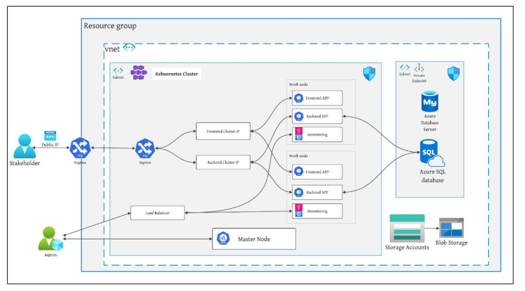

# DevOps Bootcamp(SDA)


## 1.Project description:
This project focuses on implementing a DevOps workflow for a containerized authentication application provided by the development team. The objective was to fully automate the deployment, infrastructure provisioning, monitoring, and team collaboration using industry-standard DevOps practices.We followed Agile practices throughout the project to ensure iterative development, continuous feedback, and effective team collaboration.
We designed and maintained four Azure DevOps pipelines to automate testing, code quality analysis, Docker image creation, and deployment for both frontend and backend services. Terraform was used to manage Azure resources with remote state stored in a secure storage account, while Kubernetes handled deployment and scaling.


## 2.Project Architecture 



This is the architecture of a three-tier Kubernetes-based application deployed in Azure.
The Kubernetes cluster includes:
Two worker nodes running the frontend app, backend app, and monitoring tools.
A master node (managed by Azure, not user-accessible) responsible for scheduling, scaling, and managing the cluster state.
Flow of the Request
A Stakeholder sends a request via a Public IP exposed through the Ingress Controller.Ingress routes the traffic to the appropriate internal service:Frontend Service or Backend Service .The services are exposed internally using ClusterIP.
### What does the architecture provide?
#### High Scalability
Auto-Scaling: AKS supports horizontal pod autoscaling based on CPU, memory, or custom metrics.
Load Balancers: Automatically scales traffic distribution.
Elastic SQL Pools: Azure SQL can auto-scale based on demand.
#### High Availability
Multiple Work Nodes: AKS has multiple worker nodes distributed across availability zones.
Azure SQL Database: Provides built-in high availability with automatic failover.
Ingress with Load Balancing: Distributes traffic across multiple pods to prevent single points of failure.
#### High Security
Private Endpoints: SQL Database is isolated from the public internet.
NSGs and Subnet Isolation: Controls traffic between application tiers.
Managed Identity: Allows secure AKS-to-SQL access without hardcoding credentials.
Ingress TLS: Encrypts data in transit.
#### Cost Optimized
Node Autoscaling: Automatically scales AKS nodes based on demand.
Azure Blob Storage Lifecycle Policies: Reduces storage costs by archiving old data.
Containerized Workloads: Efficient resource usage with containers.

## 3.Terraform:
This project uses Terraform to provision and manage cloud infrastructure in Microsoft Azure using the Infrastructure as Code (IaC) approach. The repository is organized into reusable modules and a root configuration, which together define the full deployment. 

### Modules
This folder contains reusable Terraform modules used across the project.
Modules content 
Resource Group: Creates a resource group to group related Azure resources.
Network: Provisions a virtual network, subnets, and attaches Network Security Groups (NSGs).
Database: Deploys an Azure SQL Server, a SQL Database, and a private endpoint for secure internal access.
AKS: The AKS module provisions a managed Kubernetes cluster with a default node pool of two worker nodes (refer to the repository for full code). 
#### State Backend 
The following backend block in providers.tf configures remote state storage using an Azure Storage Account. This setup ensures state persistence and collaboration across teams. 


##### To create the backend resources, run:

```
az storage account create --name yourStorageAccount --resource-group yourResourceGroup --location yourLocation

az storage container create --name terraformstate --account-name yourStorageAccount

# Update the parameters above to match your setup

```

## 4.Kubernetes
In this project, we use Kubernetes (AKS) to deploy and manage our cloud-native application. The kubernetes/ folder includes all necessary YAML files to set up the namespace, backend, frontend, networking (Ingress, Services), and monitoring tools.
Our AKS cluster runs multiple pods across worker nodes, with internal communication via ClusterIP services and external access managed through NGINX Ingress. Monitoring components like Prometheus and Grafana are also deployed and covered in a later section.

#### To deploy all Kubernetes components:
 Ensure that you are connected to the AKS cluster, and verify that the NGINX Ingress Controller is already installed. The Azure SQL Database must also be pre-provisioned and accessible from the cluster subnet.
###### Apply all resources by running:
```
kubectl apply -f kubernetes/
```


 ## 5.Pipeline:

### Our Monorepo and CI/CD Pipelines Setup

We use a monorepo approach, which means all our project code lives in a single repository. Inside this repository, we have four main folders, each representing a different ##### part of our system:
frontend/ — contains the code for our user interface
backend/ — contains our server and API code
terraform/ — contains infrastructure as code scripts to manage cloud resources
Kubernetes/ — contains Kubernetes deployment configurations

### Frontend Pipeline
Main Steps of Our Frontend CI/CD Pipeline
1. Trigger Section
This section configures the pipeline to trigger only when changes are pushed to the main branch and only if the changes affect files inside the authentication_app_frontend folder. This optimizes pipeline runs to only necessary builds.
2. Installing Node.js
We install Node.js version 18.x because our frontend depends on Node-based tools like npm for package management and testing.
3. Running Tests: Ensuring Our Code Works
This part runs npm install to install dependencies and npm test to execute automated tests, verifying that the frontend code functions as expected.
4. Static Code Analysis with SonarQube
We integrate SonarQube to analyze code quality and identify bugs, code smells, and security issues in the frontend code. This step requires a configured SonarQube service connection in Azure DevOps and a valid sonar-project.properties file in the frontend directory.
5. Building the Docker Image: Packaging Our App
We build a Docker image of our frontend app using the latest code so it can run consistently anywhere inside containers.
6. Pushing the Image to DockerHub
We push the Docker image to DockerHub to make it available for deployment.


### Backend Pipeline
Main Steps of Our Backend CI/CD Pipeline
1. Trigger Section
This section configures the pipeline to trigger only when changes are pushed to the main branch and only if the changes affect files inside the authentication_app_Backend folder. This optimizes pipeline runs to only necessary builds.
2. Setting Up the Environment: Installing Node.js
We install Node.js version 18.x because our backend depends on Node-based tools like npm for package management and testing.
3. Running Tests: Ensuring Our Code Works
This step runs npm install to install dependencies and npm test to execute automated tests, verifying that the backend code functions as expected.
4. Static Code Analysis with SonarQube
We integrate SonarQube to analyze code quality, detect bugs, code smells, and ensure secure and maintainable code in the backend. This step assumes a configured SonarQube service connection in Azure DevOps and a valid sonar-project.properties file in the backend directory.
5. Building the Docker Image: Packaging Our App
We build a Docker image of our backend app using the latest code so it can run consistently in any containerized environment.
6. Pushing the Image to DockerHub
We push the Docker image to DockerHub to make it available for deployment.
### Terraform Pipeline

 Main Steps of Our Terraform CI/CD Pipeline
1. Trigger Pipeline on Infrastructure Code Changes
The pipeline is triggered only when changes are pushed to the main branch and only if the changes are within the Terraform-v02/ folder. This ensures that the pipeline runs only when infrastructure code is modified.
2. Deploy Infrastructure Using Terraform
Install Terraform:
 Terraform CLI is installed on the Azure DevOps agent to enable infrastructure provisioning.
Set Azure Credentials:
 Azure authentication details (such as client ID, client secret, subscription ID, and tenant ID) are securely passed to the pipeline using environment variables stored in pipeline secrets.
Create Azure Resources for Remote State:
 A resource group, storage account, and blob container are created to store the remote Terraform state. This allows for consistent state management and collaboration.
Initialize and Apply Terraform:
 terraform init initializes the working directory and sets up the backend using the remote state storage.
 terraform apply provisions the defined infrastructure in Azure, automatically approving changes without manual input.

### Kubernetes Pipeline

Main Steps of the Kubernetes CI/CD Pipeline
1. Trigger Pipeline When Kubernetes Files Are Changed
The pipeline is configured to trigger only when:
Code is pushed to the main branch
Changes are made specifically within the kubernetes/ folder
This ensures the pipeline runs only when Kubernetes-related configurations are updated.
2. Get AKS Credentials & Deploy with Helm
Retrieve AKS Credentials:
 The pipeline authenticates with Azure Kubernetes Service (AKS) using the Azure CLI to fetch cluster credentials.
 This step enables interaction with the AKS cluster from within the pipeline.
Set Up NGINX Ingress Controller:
 The pipeline installs the NGINX Ingress Controller using Helm.
 It creates a dedicated namespace (ingress-nginx) and configures the ingress controller to expose services using a LoadBalancer.
Deploy Kubernetes Resources:
 The pipeline executes a deploy.sh script that applies the Kubernetes manifests.
 This script likely contains kubectl apply commands to deploy or update services, deployments, and other resources within the cluster.


## 6.Montring :
In our monitoring setup, we have deployed three main pods, each responsible for a specific aspect of system and application monitoring: 
### 1. Prometheus:
 Prometheus is used to collect and store metrics from various sources within the environment. In this setup, Prometheus monitors standard system metrics using Node Exporter, as well as additional custom application metrics.
 ### 2. Grafana:
 Grafana is used to visualize the metrics collected by Prometheus. It supports two types of dashboards:
 Node Exporter Dashboard: A ready-made template that displays system-level metrics such as CPU, memory, disk, and network statistics.
  Custom Dashboards: Manually built dashboards tailored to specific application needs, allowing users to monitor any defined metrics in a visual format. 
Grafana provides an interactive and user-friendly interface for real-time monitoring and alerting. 
## 3. SonarQube:
 SonarQube is used for static code analysis of the frontend and backend applications. It scans the source code to detect bugs, vulnerabilities, code smells, and maintainability issues. This helps ensure code quality and security before deployment. 
System Monitoring with Prometheus and Grafana:


## 7.Running steps:
The deployment and execution of the Authentication Project are fully automated through four Azure DevOps pipelines. These pipelines are triggered automatically upon changes to their respective Git repositories, or can be manually executed via the Azure DevOps interface.
### 1- Terraform Pipeline:
Trigger: Any changes pushed to the Terraform-02 Git repository.
Manual Run: Can also be executed manually from Azure DevOps.
Responsibility:Installs Terraform, creates Azure resources (resource group, storage account, container), retrieves the remote state from the storage account, and runs terraform apply to provision infrastructure.
### 2- Kubernetes Pipeline:
Trigger: Any changes pushed to the kubernetes Git repository.
Manual Run: Can also be executed manually from Azure DevOps.
Responsibility: Gets AKS credentials, installs NGINX Ingress via Helm, injects the external IP into the config map, and deploys Kubernetes manifests using a shell script.
### 3- Frontend Pipeline:
Trigger: Any changes pushed to the authentication_app_frontend Git repository.
Manual Run: Can also be executed manually from Azure DevOps.
Responsibility: Runs tests, performs SonarQube analysis, builds and pushes a Docker image, and restarts the frontend deployment on AKS.
Note: The SonarQube service connection in Azure DevOps should be updated to match the external IP of the SonarQube LoadBalancer service to ensure successful analysis.
### 4- Backend Pipeline:
Trigger: Any changes pushed to the authentication_app_backend Git repository.
Manual Run: Can also be executed manually from Azure DevOps.
Responsibility: Runs tests, performs SonarQube analysis, builds and pushes a Docker image, and restarts the backend deployment on AKS.
Note: The SonarQube service connection in Azure DevOps should be updated to match the external IP of the SonarQube LoadBalancer service to ensure successful analysis.


